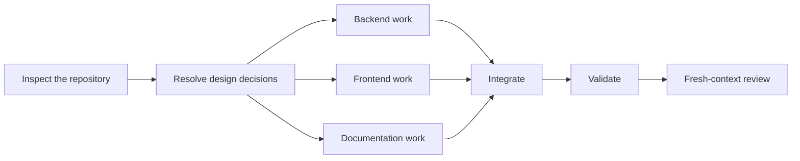

# Code with Task Graphs

A portable Codex skill for planning and running complex coding work as a dependency graph instead of one long agent loop.



The graph is the coarse workflow: tasks become ready only after their dependencies pass, independent work can run in parallel, and a failed branch can be retried without throwing away unrelated completed work. Small, bounded implement-check-repair loops can still happen *inside* a graph node.

## What it adds

- Dependency and cycle validation before coding starts
- A calculated ready set for safe parallel work
- Atomic task claims with stale-worker fencing
- Declared file scopes and overlap checks for concurrent writers
- Evidence receipts for checks and changed files
- Localized retries that invalidate only affected descendants
- Resume support through a persistent task ledger
- Fan-in integration, full validation, and fresh-context review gates
- Immutable finalized runs for later auditing

The bundled Python ledger has no third-party dependencies. It records and validates orchestration state; it does **not** edit code, run tests, spawn agents, create worktrees, commit, push, deploy, or independently prove that a worker's receipt is truthful. Those actions remain visible and controlled by Codex.

## Install

### One command with GitHub CLI

```bash
gh skill install jmmsalsalem-collab/code-with-task-graphs code-with-task-graphs --agent codex --scope user
```

### Manual installation

Clone or download this repository, then copy:

```text
skills/code-with-task-graphs
```

to:

```text
$HOME/.agents/skills/code-with-task-graphs
```

Restart Codex if it does not discover the skill immediately.

Requirements: Codex and Python 3. Git is optional, but enables baseline snapshots when the skill is used inside a repository.

## Use

Ask Codex:

```text
Use $code-with-task-graphs to plan and execute this coding task as a dependency graph.
```

Good fits include cross-layer features, migrations, public API changes, authentication work, concurrency changes, and other tasks with several independently verifiable stages. For a trivial one-file edit, a normal single-agent workflow is usually simpler.

## Why a graph instead of a loop?

A loop repeatedly gives an agent another turn. That can be useful for a narrow task, but it does not inherently represent which work depends on what, which branches are safe to run together, or which completed work should survive a failure.

A directed acyclic graph makes those relationships explicit:

- **Dependencies:** a task starts only when its required inputs are ready.
- **Parallelism:** independent branches may run at the same time.
- **Fan-in:** integration and validation wait for all required branches.
- **Localized repair:** only the failed task and affected descendants are retried.
- **Auditability:** every node has a contract, checks, evidence, and status.

This is not a claim that graphs replace loops everywhere. The practical pattern is a graph between tasks and short, bounded loops within tasks.

## Repository layout

```text
skills/code-with-task-graphs/
├── SKILL.md
├── agents/
│   └── openai.yaml
└── scripts/
    └── task_graph.py
```

`SKILL.md` contains the complete workflow. `task_graph.py` is the dependency-free state ledger used by the skill.

## Validation

This release has been checked with the official Codex skill validator, fresh-agent behavior tests, Python syntax checks, state-transition scenarios, and an independent integrity review. These checks reduce packaging and orchestration mistakes; they do not guarantee that every coding task or agent output will be correct.

## Background

- [Codex skills documentation](https://learn.chatgpt.com/docs/build-skills)
- [Claude Code agent teams](https://code.claude.com/docs/en/agent-teams)
- [Anthropic: Building effective agents](https://www.anthropic.com/engineering/building-effective-agents)
- [Graph Skill](https://github.com/gwaghmar/graph)
- [Beads](https://github.com/gastownhall/beads)

No open-source license has been selected yet.
